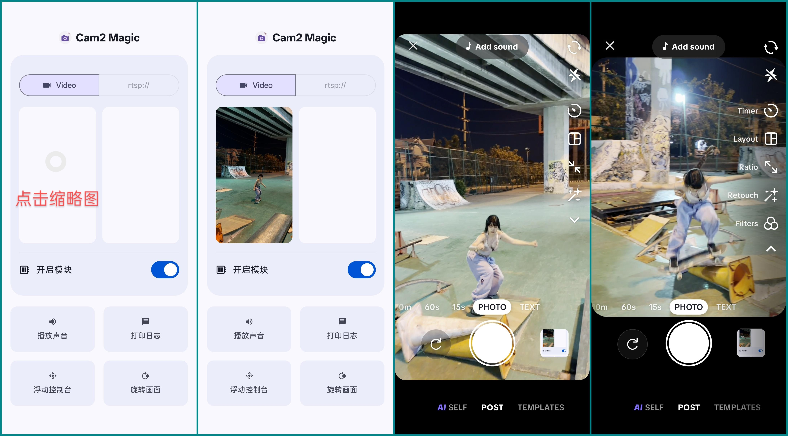

# Camera2 Magic：一个虚拟摄像头软件？支持 android 10 +   

[ README_EN.md ](README_EN.md)  ENGLISH Version translated by Google

**请不要用于非法用途**

## 文档  
- 点击 [workflow.md](document/workflow.md) 查看   

## 使用注意事项
    **开发测试用机器: oneplus 8T lpddr4 (colorOS port 16.0)**
- 视频文件需要放在本地公共存储目录，如： `DCIM`、`MOVIES`等    
- 必须授予模块读取媒体权限
- 必须授予目标应用读取媒体权限
- 手机需要`root`并安装`lsposed模块`，在`lsposed manager`中启用模块，勾选作用域（`tiktok`, `telegram` ...）   
- 模块安装、更新后需要强制关闭被Hook的应用，重新打开才会生效
- 打开本模块，点击缩略图区域，弹出系统媒体选择器：选择一个视频文件，并确认    
- 根据需要，启用声音等其他功能  
- 如果需要使用浮动面板功能，需要授权被Hook应用的浮动窗口权限    
- 打开被Hook的应用，使用相机功能，应该能看到预览画面被你的视频替换了    
- 如果未能按预期工作，请开启打印日志功能。使用 `adb logcat | grep "VCX"`

  
## 开发进度  

### 优化
  - [x] 删除未使用资源，减少安装包体积: 48M -> 8M  
  - [x] native端混沌代码重写为模块化  
  - [x] 改善 camera1 api 拍照性能，由native端直接生成jpeg ByteArray，不再使用java端生成照片  
    
### hook camera1/2 api  
  - [x] 初步检测目标应用的工作模式（普通，扫码，人脸检测）
    - [x] HOOK所有工作模式（默认，扫码和人脸检测不会专门去处理）  
  - [x] 选择本地媒体视频解码   
    - [x] 使用 ffmpeg demuxer，完成一些网络视频流支持的初期工作   
    - [x] AMediaCodec 视频硬解码（sm8250大致流畅 4k@60fps HEVC）  
      - [x] 双缓冲 (Ping-Pong Mechanism)  
      - [x] 使用GPU转码nv21  
    - [x] 音频解码 初步的音频支持  
  - [ ] 使用网络视频流  
  - [x] 替换预览画面  
    - [x] 修正`preview surface`绘制与`视觉宽高`保持一致  
    - [x] 裁切图像适配 `preview surface` ratio，尽可能不会拉伸变形  
    - [x] 适配目标应用实时切换 ratio    
  - [x] 生成 `nv21 byte[]`   
    - [x] `camera1 api` 拍照 使用当前 nv21 bytes数据（默认）   
    - [x] 强制将 `nv21 data`转换为`视觉正像`（默认）
  - [ ] 使用指定图片替换拍照数据 ？

### 模块自身UI
  - [x] 主界面
    - [x] 申请媒体权限
    - [x] 点击空白缩略图选择媒体文件/长按缩略图删除
  - [x] 功能开关
    - [x] 模块临时开关
    - [x] 播放音频开关
    - [x] 打印日志开关（错误日志依然会打印）
    - [x] 注入浮动面板开关
 
 
### **已知问题**
  - [x] BILIBILI相机无法使用。 已修复       
  - [x] 视频边缘绿线。已修复      
  - [x] camera1 api 在拍照和录制视频后未能正确停止解码播放等线程。 已修复    
  - [x] camera2 api 部分应用在某些菜单中切换(`tiktok: POST<->TEMPLATES`)，未能正确hook相机的close信号，导致无法预期的停止启动解码线程。 已修复    
  - [x] 如果是在运行时授权应用相机权限，4k视频在较早机型上存在音频偷跑、视频马赛克，可在正常预览后通过切换前后摄像头临时解决，sm8250 lpddr4 8g ram，4k视频处理vpu极限了。  已修复
  - [x] 某些应用的surface ratio切换时不能正确处理导致画面卡住。 已修复
    
### 向目标应用注入浮动窗口，用来开发调试      
  - [x] 浮动窗口框架  
  - [x] 以低分辨率和帧率预览 nv21 bytes  
  - [ ] 完成其他功能菜单  

### 文档  
  - [x] 详细的文档

